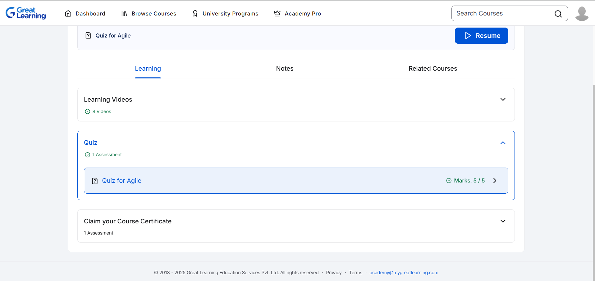
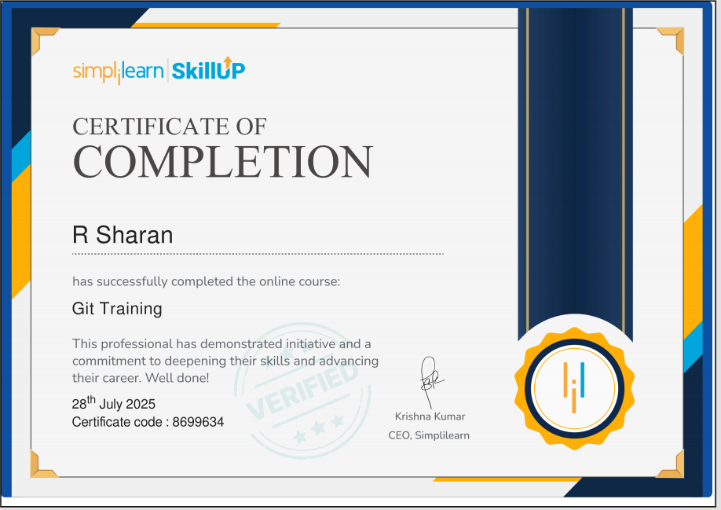
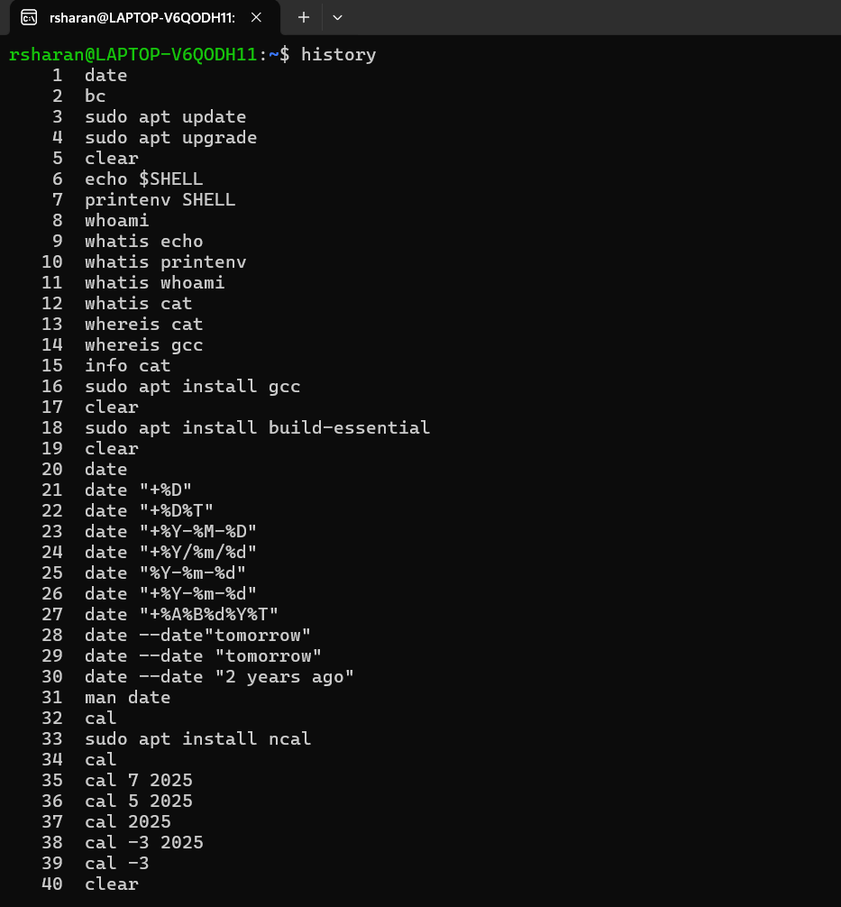
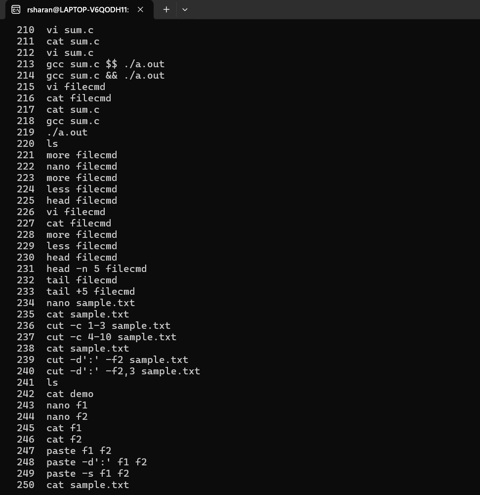

# 5509210_R Sharan
## 📝 SDLC - Great Learning
[]

## 📝 GIT - Simplilearn
[]

## 📝 Linux - Commands Practice

I am documenting my daily Linux practice.  
For each day, I include **one sample screenshot here** and the **full set of screenshots in PDF format** inside the `Linux/` folder.

### 📌 Day 2
Sample Screenshot:  
  

👉 Full screenshots: [Linux/Linux_commands_Day2.pdf](Linux/Linux_commands_Day2.pdf)

---

### 📌 Day 3
Sample Screenshot:  

👉 Full screenshots: [Linux/Linux_commands_Day3.pdf](Linux/Linux_commands_Day3.pdf)
